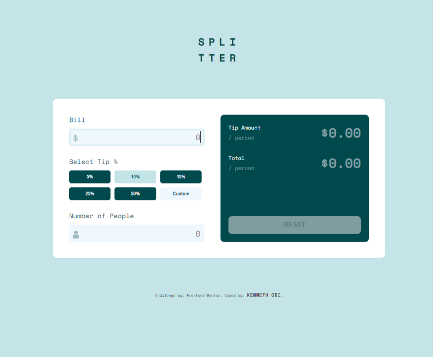

# Frontend Mentor - Tip calculator app solution

This is a solution to the [Tip calculator app challenge on Frontend Mentor](https://www.frontendmentor.io/challenges/tip-calculator-app-ugJNGbJUX). Frontend Mentor challenges help you improve your coding skills by building realistic projects.

## Overview

### The challenge

Users should be able to:

- View the optimal layout for the app depending on their device's screen size
- See hover states for all interactive elements on the page
- Calculate the correct tip and total cost of the bill per person

### Screenshot

### Links

- Solution URL: [https://github.com/kennyoungC/tip-calculator-app-main.git](https://your-solution-url.com)
- Live Site URL: [Add live site URL here](https://tip-app-calculator-kenneth)

## My process

### Built with

- Semantic HTML5 markup
- CSS custom properties
- Flexbox
- CSS Grid

### What I learned

with this i now understand how event delegation works
and its really helpful

## Author

- Website - [KENNETH OBI](https://www.your-site.com)
- Frontend Mentor - [@kennyoungC](https://www.frontendmentor.io/profile/yourusername)

## Acknowledgments

I want to appreciate everyone providing feedback on my solutions. It definitely helps to find new ways to code and find easier solutions!
